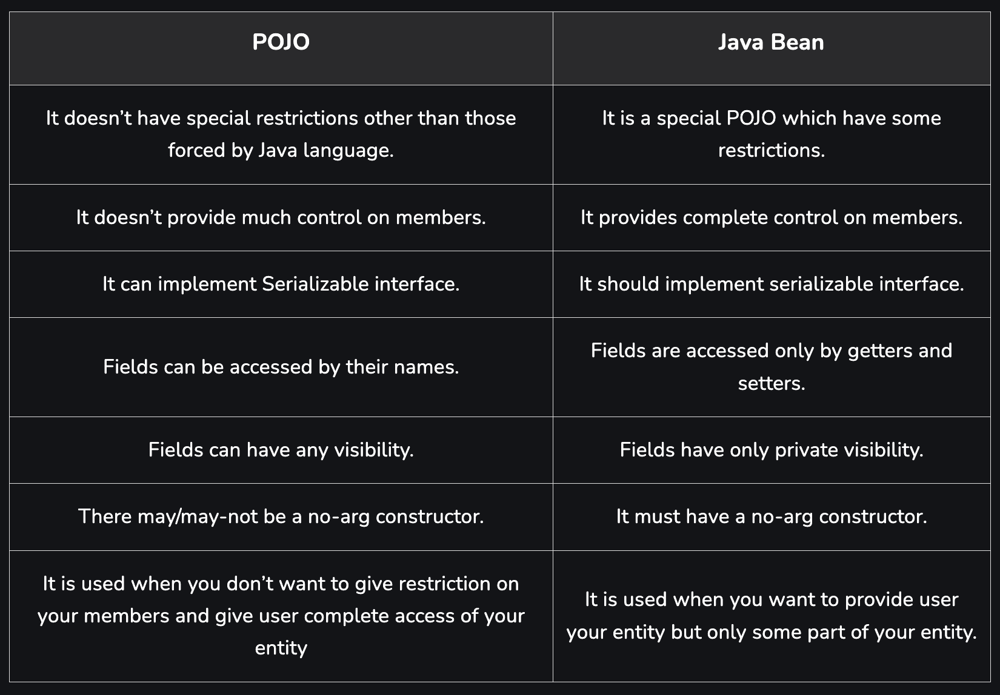

## `POJO(Plain Old Java Object)`

`POJO`는 평범한 자바 객체로 자바 언어 이외의 특별한 제약이 없다.

다음 세 가지는 POJO가 아니다.

1. 프레임워크 종속하는 클래스 확장

   ```java
   public class GFG extends javax.servlet.http.HttpServlet { … }
   ```

2. 프레임워크 종속하는 인터페이스 구현

   ```java
   public class Bar implements javax.ejb.EntityBean { … }
   ```

3. 특정 프레임워크에 종속되는 어노테이션 사용

   ```java
   @javax.persistence.Entity public class Baz { … }
   ```

POJO는 보통 entity를 정의할 때 사용한다.

```java
// Employee POJO class to represent entity Employee
public class Employee
{
    // default field
    String name;

    // public field
    public String id;

    // private salary
    private double salary;

    //arg-constructor to initialize fields
    public Employee(String name, String id,
                             double salary)
    {
        this.name = name;
        this.id = id;
        this.salary = salary;
    }

    // getter method for name
    public String getName()
    {
        return name;
    }

    // getter method for id
    public String getId()
    {
        return id;
    }

    // getter method for salary
    public Double getSalary()
    {
        return salary;
    }
}
```

POJO는 가독성과 재사용성이 좋다.

## Java Beans

POJO에 몇 가지 제약을 걸면 Java Beans이 된다.

1. 모든 Java Beans는 POJO다.
2. `getter`와 `setter` 둘 중 하나 이상은 있어야한다.
3. 필드는 private 해야한다.
4. 필드는 `getter`와 `setter`를 통해서만 접근이 가능하다.

외에 다음과 같은 차이점이 존재한다.



- [POJO vs Java Beans | GeeksforGeeks](https://www.geeksforgeeks.org/pojo-vs-java-beans/)

- [What is POJO Class in Java ?. POJO stands for Plain Old Java Object… | by Bharat Kumar | Medium](https://medium.com/@Bharat2044/what-is-pojo-class-in-java-1325eb7f3a6c)
