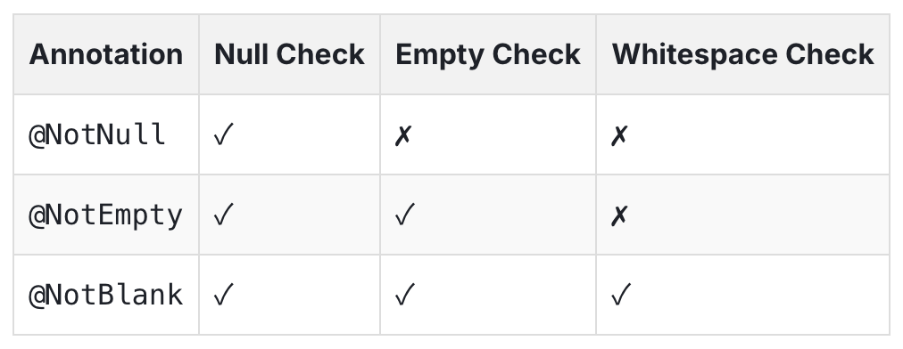

## `@NotNull` vs `@NonNull`

1. `@NotNull`

- `jakarta.validation.constraints.NotNull` 출처
- 런타임 벨리데이션 수행

2. `@NonNull`

- `org.springframework.lang.NonNull` 출처
- IDE에 의해 사용되며 정적 분석을 통한 타입 힌트 제공. 런타임에 영향 없음

대표적인 사용 방법은 다음과 같다.

1. DTO나 Entity 정의시 Nullable하지 않은 필드에 대해서는 `@NotNull`을 사용한다.
2. 문서를 정의할 때는 굳이 run time validation check가 필요하지 않으므로 `@NonNull`을 사용한다.
3. 다른 Annotation과 함께 `@NotNull`을 사용한다. 예를들어 `@Size`와 함께 사용하면, 필드가 비어있지 않고, 특정 길이 제한을 지켜야한다 라는 두 가지 조건을 검증할 수 있다.
4. 아래와 같이 구현체가 아닌 규약을 정의하는 interface에서는 `@NonNull`사용이 가능하다.

```java
// Handling Nullability in Interfaces
public interface UserService {
    @NonNull User findUser(@NonNull String username);
}
```

### References

[@NotNull vs @NonNull: Your Secret Weapons Against NPEs in Spring Boot | by Ahmed Safwat | Medium](https://medium.com/@ahmed.abdelfaheem/notnull-vs-nonnull-your-secret-weapons-against-npes-in-spring-boot-d4ae6402481a)

## `@NotNull` vs `@NotEmpty` vs `@NotBlank`



1. `@NotNull`
   null을 허용하지 않는다. 다만 빈 문자열 + 공백만을 포함한 문자열은 유효하다.2

   ```java
   public class User {
       @NotNull(message = "Name cannot be null")
       private String name;
       // Constructors, getters, and setters
   }
   ```

   객체가 null인지 확인할 때 사용한다.

2. `@NotEmpty`
   `@NotNull`과는 다르게 비어있는 것을 막아준다. 문자열 뿐만 아니라 collection의 요소 포함 여부도 확인 가능하다.

   ```java
   public class ShoppingCart {
   @NotEmpty(message = "Cart must contain at least one item")
   private List<Product> items;
   @NotEmpty(message = "Customer email is required")
   private String customerEmail;
   }
   ```

   collection이 하나 이상의 원소를 포함하는지 확인할 때 사용한다.

3. `@NotBlank`
   빈 문자열도 허용하지 않는 가장 강한 제약을 건다.

   ```java
   public class UserProfile {
    @NotBlank(message = "Username must contain meaningful characters")
    private String username;
    @NotBlank(message = "Bio cannot be empty or just whitespace")
    private String bio;
   }
   ```

   유저의 입력 필드를 확인할 때 사용한다.

조금 더 포괄적인 유효성 검사를 위해 다른 annotation과 함께 사용하는 것도 가능하다.

```java
public class ComplexValidationExample {
    @NotBlank
    @Size(min = 3, max = 50, message = "Username must be between 3 and 50 characters")
    private String username;
    @NotNull
    @Min(value = 18, message = "Age must be at least 18")
    private Integer age;
}
```

### References

[Difference Between @NotNull, @NotEmpty, and @NotBlank](https://www.byteplus.com/en/topic/407512?title=difference-between-notnull-notempty-and-notblank-in-java-bean-validation)
